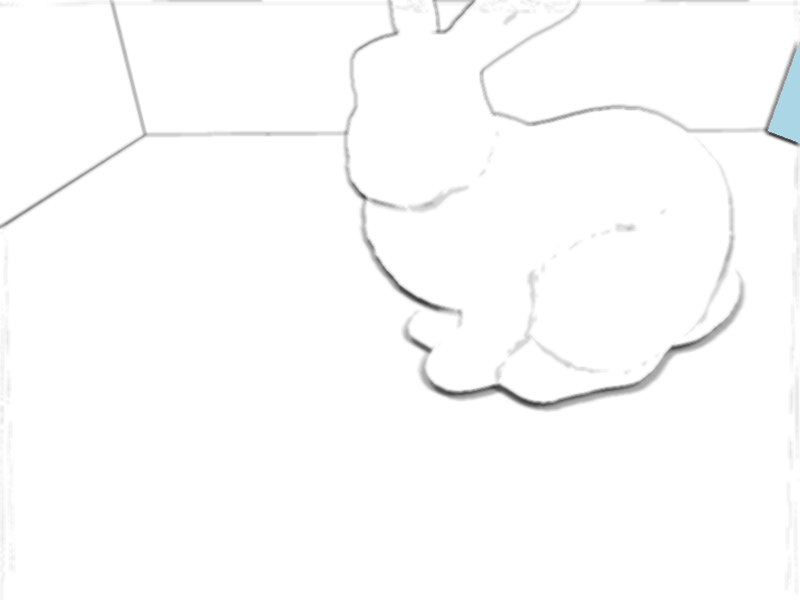
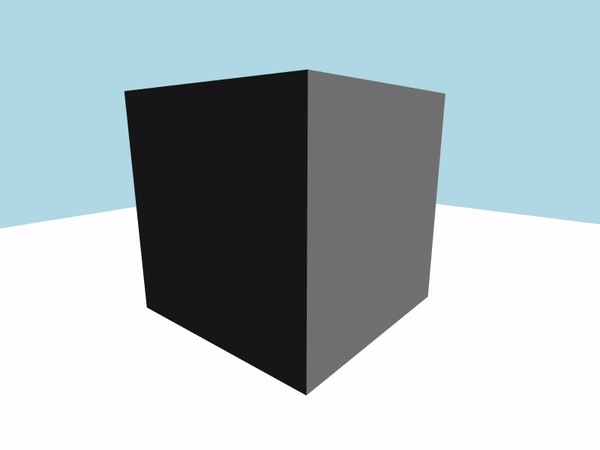
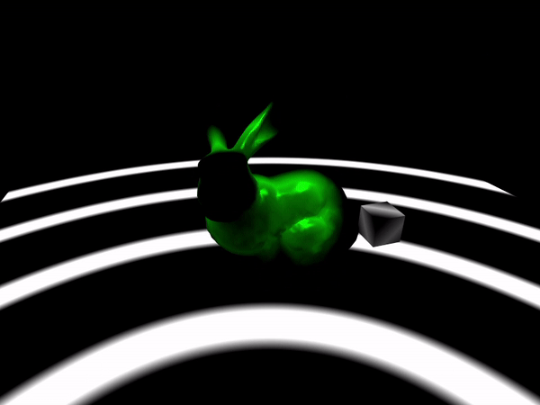

# IceRender

This project is for learning, practicing C++/OpenGL/glsl and having some fun.

[Simple Instruction](./README2.md)

---------------------------------------------------------------------------------------------------------------------

- create/load scene via *.json* file
- load *.off/.obj*(vertices, normals and uv only) 
- shader codes generator
- forward/deferred shading
- SAT(Summed-Area Table)
- [multiple shadow techniques](https://github.com/pyuan-21/IG3DA-project)
- [ssao/ssdo](https://github.com/pyuan-21/INF584-project)
  

    
  

- misc:
  

    
    
  

